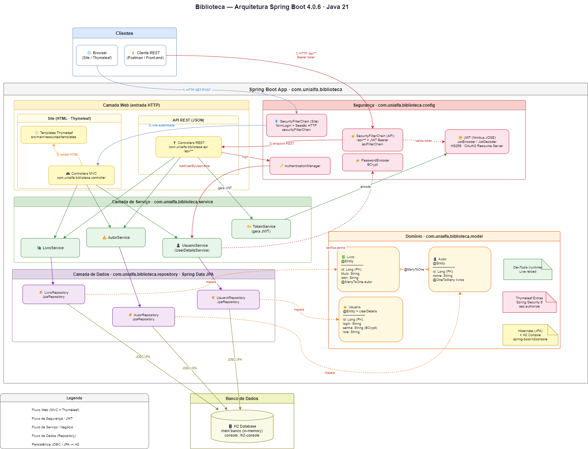
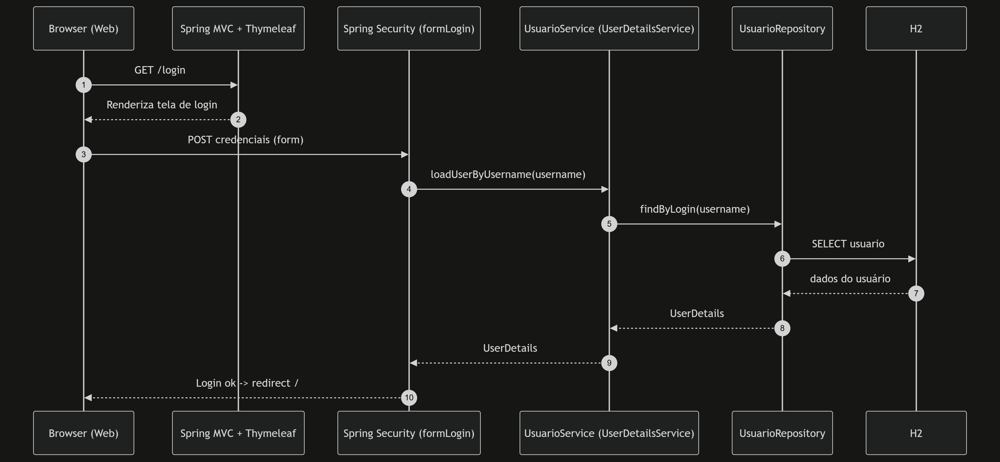
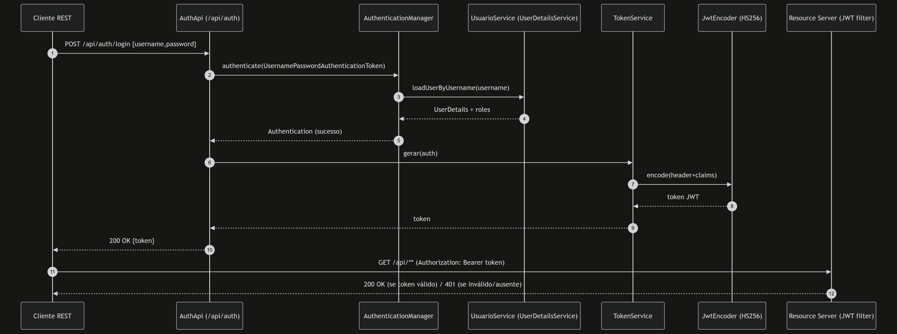

# Biblioteca

Este projeto é uma aplicação web de **Biblioteca** construída com **Spring Boot**, com duas formas de acesso:

- **Aplicação Web (Thymeleaf)**: interface HTML com autenticação via **login por formulário**.
- **API REST (`/api/**`)**: endpoints REST protegidos com **JWT (Bearer Token)**.

## Arquitetura

A aplicação segue uma arquitetura em camadas (MVC + Service + Repository), com separação por pacotes:

- **`com.unialfa.biblioteca.controller`**
  - Controllers MVC (retornam páginas/`templates` Thymeleaf).
  - Ex.: `LivroController`, `AutorController`, `UsuarioController`, `LoginController`.

- **`com.unialfa.biblioteca.api`**
  - Controllers REST (retornam JSON), expostos em `/api/**`.
  - Ex.: `AuthApi` (login e geração do token), `LivroApi`, `AutorApi`.

- **`com.unialfa.biblioteca.service`**
  - Regras de negócio e serviços transversais.
  - Ex.: `LivroService`, `AutorService`, `UsuarioService` e `TokenService`.

- **`com.unialfa.biblioteca.repository`**
  - Repositórios Spring Data (acesso a dados).
  - Ex.: `LivroRepository`, `AutorRepository`, `UsuarioRepository`.

- **`com.unialfa.biblioteca.model`**
  - Entidades JPA (`@Entity`) e modelo de domínio.
  - Ex.: `Usuario`, `Livro`, `Autor`.

- **`com.unialfa.biblioteca.config`**
  - Configurações da aplicação.
  - Ex.: `SecurityConfiguration` (segurança e autenticação).

### Diagrama da Arquitetura

- **Diagrama .mmd**: [`docs/arquitetura.mmd`](docs/arquitetura.mmd)
- **Diagrama .drawio**: [`docs/arquitetura.drawio`](docs/arquitetura.drawio)

### Diagrama do fluxo de autenticação

- **Fonte (Web / formLogin)**: [`docs/auth-web.mmd`](docs/auth-web.mmd)

- **Fonte (API / JWT)**: [`docs/auth-api-jwt.mmd`](docs/auth-api-jwt.mmd)
  

### Fluxo de dados (visão geral)

- **Web (Thymeleaf)**
  - Browser -> `controller/*` -> `service/*` -> `repository/*` -> H2
  - As views ficam em `src/main/resources/templates/**`.

- **API (`/api/**`)**
  - Cliente REST -> `api/*` -> `service/*` -> `repository/*` -> H2
  - Proteção por token JWT (exceto login).

## Frameworks e bibliotecas

Conforme o `pom.xml`:

- **Spring Boot 4.0.6**
  - Base do projeto, autoconfiguração e inicialização.

- **Spring Web MVC (`spring-boot-starter-webmvc`)**
  - Controllers, rotas, validações e camada web.

- **Thymeleaf (`spring-boot-starter-thymeleaf`)**
  - Renderização de HTML no servidor (templates).
  - Integração com segurança via `thymeleaf-extras-springsecurity6`.

- **Spring Data JPA (`spring-boot-starter-data-jpa`)**
  - Persistência com JPA/Hibernate e repositórios.

- **H2 Database**
  - Banco em memória (configurado em `application.properties`).
  - Console habilitado em `/h2-console`.

- **Spring Security (`spring-boot-starter-security`)**
  - Autenticação/Autorização.
  - Dois modos: form-login (web) e resource server JWT (API).

- **Spring OAuth2 Resource Server (`spring-boot-starter-oauth2-resource-server`)**
  - Validação de token JWT no modo Bearer Token para `/api/**`.

## Configurações (application.properties)

- **H2**: `spring.datasource.url=jdbc:h2:mem:banco`
- **Console H2**: `spring.h2.console.path=/h2-console`
- **Segredo JWT**: `api.security.token.secret=...`
  - Este valor é usado para assinar e validar tokens (HMAC SHA-256).

## Autenticação e autorização (detalhamento)

A segurança está centralizada em `com.unialfa.biblioteca.config.SecurityConfiguration`.

O projeto define **duas cadeias de filtros** (`SecurityFilterChain`) separadas:

- **`apiFilterChain` (Order 1)**: vale somente para rotas `/api/**` e usa JWT.
- **`securityFilterChain` (Order 2)**: vale para o restante do site (Thymeleaf) e usa form-login.

### 1) `@Configuration` e `@EnableWebSecurity`

- **`@Configuration`**
  - Informa ao Spring que a classe declara beans (`@Bean`).
- **`@EnableWebSecurity`**
  - Habilita a configuração de segurança web do Spring Security.

### 2) Propriedade `secret` (`@Value("${api.security.token.secret}")`)

- Lê o segredo definido em `application.properties`.
- É usado para criar as chaves de **assinatura** e **validação** do JWT (algoritmo HS256).

### 3) Cadeia da API: `apiFilterChain(HttpSecurity http)`

Trecho principal:

- **`.securityMatcher("/api/**")`**
  - Diz que esta cadeia **só** se aplica a endpoints que começam com `/api/`.
  - Isso permite ter um modo de segurança para a API e outro para as páginas web.

- **`.authorizeHttpRequests(...)`**
  - Define as regras de autorização.
  - **`/api/auth/login`** está como `permitAll()` porque é o endpoint onde você obtém o token.
  - **Qualquer outra rota** `/api/**` exige usuário autenticado: `.anyRequest().authenticated()`.

- **`.oauth2ResourceServer(oauth2 -> oauth2.jwt(Customizer.withDefaults()))`**
  - Ativa o modo *Resource Server*.
  - Isso faz o Spring procurar o token no header:
    - `Authorization: Bearer <token>`
  - A validação do token usa o bean `JwtDecoder` definido na própria classe.

- **`.csrf(AbstractHttpConfigurer::disable)`**
  - Desabilita CSRF para a API.
  - Motivo: API REST stateless normalmente não usa cookie de sessão; o token no header já é a credencial.

- **`.sessionManagement(...SessionCreationPolicy.STATELESS)`**
  - Garante que não haverá sessão HTTP.
  - Cada request precisa enviar o token (stateless).

### 4) Cadeia do site: `securityFilterChain(HttpSecurity http)`

Trecho principal:

- **`.authorizeHttpRequests(...)`**
  - Regras para as páginas web.
  - **`/h2-console/**` e `/usuarios/**`**: somente `hasRole("ADMIN")`.
    - Observação: `hasRole("ADMIN")` procura a authority `ROLE_ADMIN`.
  - **Recursos estáticos** (`/css/**`, `/js/**`, `/images/**`, `/webjars/**`): `permitAll()`.
  - Demais páginas: autenticadas.

- **`.formLogin(form -> ...)`**
  - Ativa login por formulário.
  - **`.loginPage("/login")`**: usa uma página customizada servida por `LoginController`.
  - **`.defaultSuccessUrl("/", true)`**: após login bem-sucedido, redireciona para `/`.
  - **`.permitAll()`**: libera acesso à página de login e ao endpoint de submissão.

- **`.logout(logout -> ...)`**
  - Configura o logout.
  - **`.logoutUrl("/logout")`**: endpoint para encerrar a sessão.
  - **`.logoutSuccessUrl("/login?logout")`**: redireciona após logout.
  - **`.permitAll()`**: logout pode ser acessado por usuários autenticados sem bloqueio extra.

- **`.csrf(csrf -> csrf.ignoringRequestMatchers("/h2-console/**"))`**
  - Mantém CSRF ligado no site (bom padrão para form-login), mas **ignora** o H2 console.
  - O H2 console normalmente usa frames e posts internos que conflitam com CSRF.

- **`.headers(headers -> headers.frameOptions( ... sameOrigin))`**
  - Ajusta `X-Frame-Options` para permitir que o H2 console funcione.
  - `sameOrigin` permite frames somente do mesmo domínio.

### 5) `PasswordEncoder` (`BCryptPasswordEncoder`)

- Bean `passwordEncoder()` retorna `BCryptPasswordEncoder`.
- Serve para:
  - Armazenar senha com hash seguro.
  - Validar senha no login.
- O `UsuarioService` usa este encoder para salvar senhas.

### 6) `AuthenticationManager`

- Bean `authenticationManager(AuthenticationConfiguration config)`.
- É o componente que executa a autenticação.
- No projeto, ele é usado no endpoint REST:
  - `AuthApi.login()` chama `authenticationManager.authenticate(...)`.

### 7) JWT: `JwtDecoder` e `JwtEncoder`

- **`jwtDecoder()`**
  - Constrói um `SecretKeySpec` com o `secret` e algoritmo `HmacSHA256`.
  - Cria um `NimbusJwtDecoder` para **validar** tokens recebidos na API.

- **`jwtEncoder()`**
  - Usa o mesmo segredo para **assinar** tokens.
  - `ImmutableSecret` + `NimbusJwtEncoder` geram o JWT HS256.

### 8) Como o login da API gera o token

Arquivo: `com.unialfa.biblioteca.api.AuthApi`

- Recebe JSON com `username` e `password` em `/api/auth/login`.
- Autentica com `AuthenticationManager`.
- Se der certo, chama `TokenService.gerar(auth)`.

Arquivo: `com.unialfa.biblioteca.service.TokenService`

- Monta `JwtClaimsSet` com:
  - **`issuer`**: "biblioteca"
  - **`subject`**: `auth.getName()` (login)
  - **`roles`**: authorities do usuário
  - **`expiresAt`**: 24h
- Assina com HS256 e retorna o token.

## Usuários padrão

Em `BibliotecaApplication`, existe um `CommandLineRunner` que cria dois usuários no start:

- `admin` / `admin` com perfil `ADMIN`
- `user` / `user` com perfil `USER`

## Como executar

- Executar a aplicação:
  - `./mvnw spring-boot:run`
- Acessos:
  - **Site**: `http://localhost:8080/`
  - **Login**: `http://localhost:8080/login`
  - **H2 Console**: `http://localhost:8080/h2-console`

## Como testar a API (exemplo)

- Fazer login e obter token (POST):
  - `http://localhost:8080/api/auth/login`
  - Body JSON:
    - `{ "username": "admin", "password": "admin" }`
- Usar token nas demais rotas:
  - Header: `Authorization: Bearer <token>`

